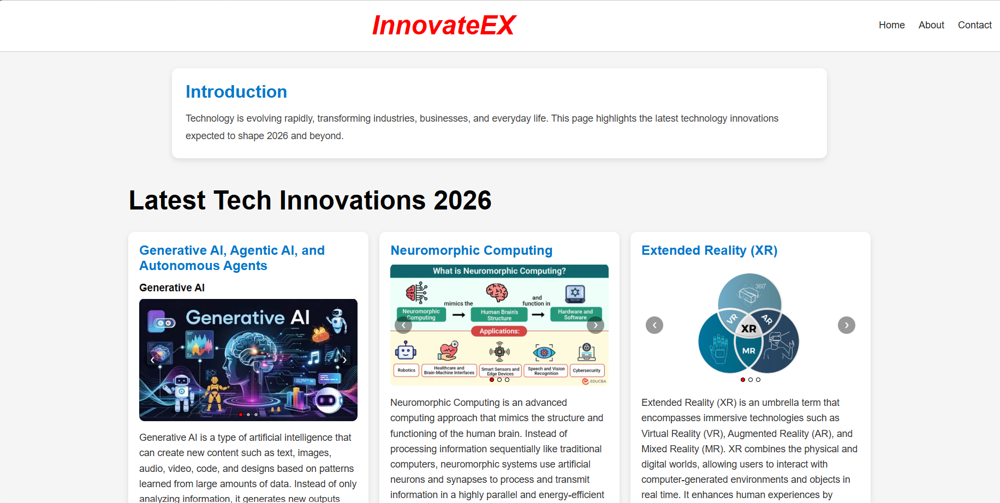
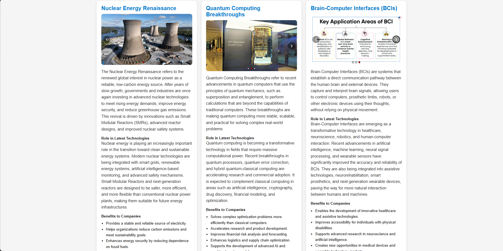

# InnovateEX

InnovateEX is a front-end web project that explores the latest and emerging technologies expected to shape 2026 and beyond - from AI and robotics to quantum computing, XR, and sustainable tech.

This project is intentionally frontend-only, built to focus on and demonstrate HTML, CSS, and JavaScript skills. Form validation and interactivity are handled entirely client-side - no backend or server integration was in scope. Instead of reading scattered articles across dozens of tabs, I wanted a single, organized place where each technology is broken down the same way every time - what it is, where it's used, why it matters to businesses, and how it's applied in the real world. Building InnovateEX was as much about learning the technologies themselves as it was about practicing front-end development.

## Features

- Clean, card-based layout covering 15 emerging technology areas
- Image carousels on every card for visual context
- Fully responsive design (mobile, tablet, and desktop layouts)
- Mobile-friendly collapsible navigation menu
- About and Contact pages

## Tech Stack

- HTML5
- CSS3 (Flexbox, CSS Grid, media queries)
- Vanilla JavaScript (no frameworks or libraries)

## Project Structure

```
InnovateEX/
├── index.html      → Home page with all technology cards
├── about.html      → About the project
├── contact.html    → Contact form
├── style.css       → All styling
├── script.js       → Shared JavaScript (menu toggle + carousel logic)
└── images/         → Carousel images for each card
```

## Live Demo

[https://architashinde.github.io/InnovateEX/](https://architashinde.github.io/InnovateEX/)

## Running Locally

1. Clone the repository:
   ```
   git clone https://github.com/architashinde/InnovateEX.git
   ```
2. Open `index.html` in your browser - no build tools or server required.

## Preview



*Desktop view showing the technology cards and image carousels.*



*Scrolled view showing additional technology cards.*


*Mobile view with the collapsible navigation menu open.*